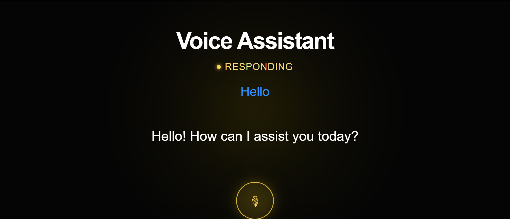

# 🎙️ Voice Assistant - V1

A full-stack Voice AI Assistant that takes voice input, converts it to text, processes it using an AI model, and responds back using speech.

Built using:
FastAPI + React + Whisper + Ollama + Piper TTS

---

# 🚀 Features

- 🎤 Voice recording from browser
- 🧠 Speech-to-text using Faster Whisper
- 🤖 AI responses using Ollama (qwen2.5:0.5b)
- 🔊 Text-to-speech using Piper TTS
- 💬 Text + Voice interaction support
- ⚡ Real-time UI updates (Listening / Processing / Responding)
- 🎧 Auto audio playback for responses

---

# 🧠 System Architecture

User Voice Input
→ Browser MediaRecorder
→ FastAPI Backend
→ Faster Whisper (Speech → Text)
→ Ollama LLM (AI Response)
→ Piper TTS (Text → Speech)
→ Audio Response

---

## Screenshots

### Home Screen


---

### Conversation




---

# 📁 Project Structure

```text
VOICE-ASSISTANT-V1/
│
├── backend/
│   ├── app/
│   │   ├── main.py
│   │   ├── services/
│   │   │   ├── llm_service.py
│   │   │   ├── whisper_service.py
│   │   │   └── tts_service.py
│   │   ├── models/
│   │   │   └── tts/en_US-lessac-medium.onnx
│   │   └── audio/
│   │       ├── recording.wav
│   │       └── response.wav
│
├── frontend/
│   ├── src/
│   │   ├── App.jsx
│   │   ├── main.jsx
│   │   └── assets/
│   ├── index.html
│   ├── package.json
│
└── README.md
```

---

# ⚙️ Backend Components

## llm_service.py
- Uses Ollama model: qwen2.5:0.5b
- Rules:
  - English only
  - Max 2 sentences
  - No markdown
  - No emojis
  - Conversational tone

---

## whisper_service.py
- Model: faster-whisper (medium)
- Device: CPU (int8)
- Converts speech → text
- Forces English language

---

## tts_service.py
- Uses Piper TTS
- Model: en_US-lessac-medium.onnx
- Converts text → speech (.wav output)

---

# 🔌 API Endpoints

## GET /
Returns backend status

Response:
{
  "message": "Voice AI Assistant Backend Running"
}

---

## POST /chat
Text-based chat with AI

Request:
{
  "message": "Hello"
}

Response:
{
  "response": "Hi, how can I help you?"
}

---

## POST /transcribe
Upload audio file → returns text

Response:
{
  "success": true,
  "text": "transcribed text"
}

---

## POST /voice-chat
Voice input → returns audio response (.wav)

---

## POST /voice-chat-json
Voice input → returns JSON response

Response:
{
  "success": true,
  "transcribed_text": "hello",
  "response": "hi there"
}

---

# 🎨 Frontend Features

- Microphone recording using MediaRecorder API
- Live speech recognition (Web Speech API)
- AI response display with typing animation
- Audio playback of AI response
- Status indicators:
  - LISTENING
  - PROCESSING
  - RESPONDING

---

# 🧠 AI Flow

Speech Input
→ Whisper Transcription
→ Ollama Processing
→ Piper TTS Output
→ Audio Playback

---

# 🛠️ Setup Instructions

## Clone repository
git clone https://github.com/meenalozhnee04/voice-assistant-v1.git
cd voice-assistant-v1

---

## Backend setup

cd backend
python -m venv venv

Windows:
venv\Scripts\activate

Install dependencies:
pip install fastapi uvicorn faster-whisper ollama piper-tts python-multipart

Run backend:
uvicorn app.main:app --reload

Backend URL:
http://127.0.0.1:8000

---

## Frontend setup

cd frontend
npm install
npm run dev

Frontend URL:
http://localhost:5173

---

# 🤖 Ollama Setup

ollama run qwen2.5:0.5b

---

# 🚫 .gitignore

venv/
node_modules/
backend/audio/*.wav
backend/temp_*
.env

---

# 🚀 Future Improvements

- Real-time streaming AI responses
- WebSocket voice streaming
- Chat memory system
- Multi-language support
- Cloud deployment
- GPU acceleration for Whisper

---

# 👨‍💻 Author

Meenalozhnee R